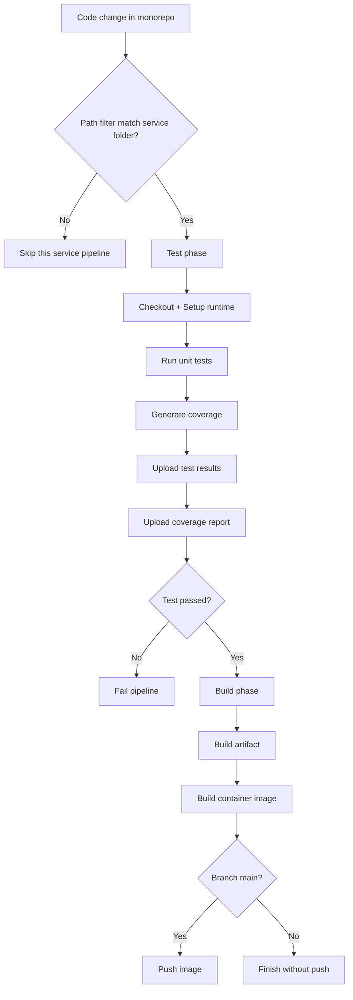
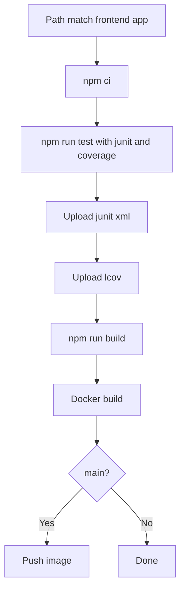
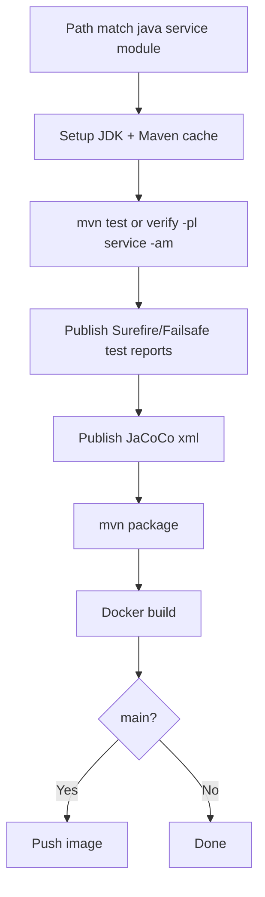

# Week 1 Draft - Monorepo CI/CD Blueprint for YAS

## 1) Muc tieu tuan 1

- Nghien cuu cau truc monorepo YAS.
- Xac dinh service/module can pipeline.
- Phac thao pipeline structure cho tung service.
- Dam bao nguyen tac: pipeline chi kich hoat cho service cu the khi co thay doi lien quan.

Luu y: Tai lieu nay la ket qua phac thao (design artifact), dung de review va chot pham vi truoc khi implement tuan 2.

## 2) Pham vi xac dinh tu codebase

Nguon doi chieu:

- Root modules Maven: [pom.xml](../pom.xml)
- Workflow hien co: [.github/workflows](../.github/workflows)
- Frontend app folders: [backoffice](../backoffice), [storefront](../storefront)

### 2.1 Danh sach service/module can pipeline

Tong doi tuong can duoc quan ly pipeline: 22

- 2 frontend apps:
  - backoffice
  - storefront
- 18 Java deployable services (co module + workflow CI):
  - backoffice-bff
  - cart
  - customer
  - inventory
  - location
  - media
  - order
  - payment
  - payment-paypal
  - product
  - promotion
  - rating
  - recommendation
  - sampledata
  - search
  - storefront-bff
  - tax
  - webhook
- 2 Java modules quan trong chua co CI rieng:
  - common-library
  - delivery

### 2.2 Hien trang workflow

- Co 21 file *-ci trong [.github/workflows](../.github/workflows)
  - 20 service/app CI workflows
  - 1 charts CI workflow (k8s/charts)
- Da co path filter theo service folder trong cac workflow service hien tai.

Ket luan tuan 1:

- Da co nen tang monorepo trigger theo thu muc service.
- Con thieu workflow rieng cho common-library va delivery.

## 3) Danh gia so voi yeu cau de bai

Yeu cau de bai:

1. Pipeline toi thieu 2 phase: Test va Build.
2. Phase Test phai upload test result va test coverage.
3. Monorepo path-based trigger: chi chay pipeline service lien quan khi co thay doi.

Danh gia hien trang:

- Trigger theo service folder: Dat mot phan (da co o da so workflows).
- 2 phase Test/Build tach biet: Chua dat day du (nhieu workflow dang gom trong 1 job Build).
- Upload test result + coverage:
  - Nhom Java: co test report + Jacoco PR report o nhieu workflows.
  - Nhom frontend: chua thay buoc unit test report/coverage ro rang.

Rui ro can neu trong bao cao:

- Cac Java workflow dang include path pom.xml va action.yaml, nen 1 thay doi chung co the kich hoat nhieu service pipelines. Dieu nay dung cho thay doi shared code, nhung neu hieu sat yeu cau "chi service do" theo nghia rat chat thi can strategy bo sung (muc 6).

## 4) Trigger matrix (phac thao de chot)

Ma tran duoi day la muc tieu can dat khi implement.

| Service/Module | Workflow de xuat | Trigger path bat buoc | Trigger path mo rong co kiem soat |
|---|---|---|---|
| backoffice | backoffice-ci.yaml | backoffice/** | .github/workflows/backoffice-ci.yaml |
| storefront | storefront-ci.yaml | storefront/** | .github/workflows/storefront-ci.yaml |
| backoffice-bff | backoffice-bff-ci.yaml | backoffice-bff/** | .github/workflows/backoffice-bff-ci.yaml |
| storefront-bff | storefront-bff-ci.yaml | storefront-bff/** | .github/workflows/storefront-bff-ci.yaml |
| cart | cart-ci.yaml | cart/** | .github/workflows/cart-ci.yaml |
| customer | customer-ci.yaml | customer/** | .github/workflows/customer-ci.yaml |
| inventory | inventory-ci.yaml | inventory/** | .github/workflows/inventory-ci.yaml |
| location | location-ci.yaml | location/** | .github/workflows/location-ci.yaml |
| media | media-ci.yaml | media/** | .github/workflows/media-ci.yaml |
| order | order-ci.yaml | order/** | .github/workflows/order-ci.yaml |
| payment | payment-ci.yaml | payment/** | .github/workflows/payment-ci.yaml |
| payment-paypal | payment-paypal-ci.yaml | payment-paypal/** | .github/workflows/payment-paypal-ci.yaml |
| product | product-ci.yaml | product/** | .github/workflows/product-ci.yaml |
| promotion | promotion-ci.yaml | promotion/** | .github/workflows/promotion-ci.yaml |
| rating | rating-ci.yaml | rating/** | .github/workflows/rating-ci.yaml |
| recommendation | recommendation-ci.yaml | recommendation/** | .github/workflows/recommendation-ci.yaml |
| sampledata | sampledata-ci.yaml | sampledata/** | .github/workflows/sampledata-ci.yaml |
| search | search-ci.yaml | search/** | .github/workflows/search-ci.yaml |
| tax | tax-ci.yaml | tax/** | .github/workflows/tax-ci.yaml |
| webhook | webhook-ci.yaml | webhook/** | .github/workflows/webhook-ci.yaml |
| common-library | common-library-ci.yaml (moi) | common-library/** | .github/workflows/common-library-ci.yaml |
| delivery | delivery-ci.yaml (moi) | delivery/** | .github/workflows/delivery-ci.yaml |

Khuyen nghi:

- De giam fan-out, khong nen de tat ca service workflows deu trigger boi pom.xml o muc bat buoc.
- Neu can xu ly thay doi shared (parent pom, common-library), dung 1 pipeline dieu huong rieng (muc 6) de quyet dinh service nao bi anh huong.

## 5) Pipeline structure de xuat cho tung service

Mau chuan toi thieu 2 phase:

1. Test phase
2. Build phase

Yeu cau artifact sau phase Test:

- Test results (JUnit XML hoac tuong duong)
- Coverage report (JaCoCo XML cho Java, lcov.info cho frontend)

### 5.1 Mermaid - Generic monorepo service pipeline

### 5.2 Mermaid - Frontend (backoffice/storefront)

### 5.3 Mermaid - Java services

## 6) Cach dam bao "chi chay pipeline cho service cu the" (Chot Rule A)

Quyet dinh chot cho bai lam: Rule A (strict path mode).

Nguyen tac ap dung:

- Moi service co workflow rieng.
- Workflow cua service chi trigger khi co thay doi trong thu muc service do va/hoac chinh file workflow cua service do.
- Khong dung trigger theo shared files (vi du pom.xml o root) trong service workflows de tranh fan-out build/test khong can thiet.

He qua mong doi:

- Dev thay doi media/** -> chi media pipeline chay.
- Dev thay doi order/** -> chi order pipeline chay.
- Dam bao sat yeu cau de bai: khong build/test lai toan bo he thong khi thay doi cuc bo 1 service.

Pham vi tuan 1:

- Chot strategy Rule A trong tai lieu va trigger matrix.
- Viec xu ly thay doi shared code theo co che impact-analysis se khong nam trong scope tuan 1.

## 7) Backlog implement sau khi chot tuan 1

1. Tao common-library-ci.yaml va delivery-ci.yaml.
2. Chuan hoa tat ca workflows thanh 2 jobs ro rang: test -> build.
3. Bo sung upload test result + coverage cho frontend workflows.
4. Chot trigger strategy Rule A va cap nhat path filters theo strict path mode.
5. Them tai lieu quy uoc CI trong docs.

## 8) Tieu chi hoan thanh tuan 1 (Definition of Done)

- Da co danh muc day du service/module can pipeline.
- Da co trigger matrix ro rang theo thu muc.
- Da co blueprint pipeline 2 phase, kem test report + coverage upload.
- Da xac dinh gap hien tai va backlog cho tuan tiep theo.
